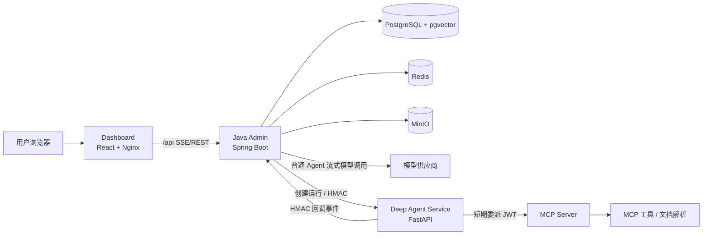

# Aether 项目总体说明

## 1. 项目定位

Aether 是一个面向企业知识库与业务工具的智能体平台。平台支持普通 Agent 的实时对话，也支持 Deep Agent 将复杂请求拆分为任务计划、调用受控
MCP 工具、向用户追问并持续回传执行过程。

平台由四个独立项目组成：Java Admin、Dashboard、Deep Agent Service 和 MCP Server。PostgreSQL、Redis、MinIO 是平台基础服务。

## 2. 系统架构



### 2.1 项目清单

| 项目                          | 技术                                       | 主要职责                                        |
|-----------------------------|------------------------------------------|---------------------------------------------|
| `aether`                    | Java 8、Spring Boot 2.7、MyBatis-Plus      | 用户、权限、Agent、知识库、模型配置、会话、运行审计、Deep Agent 编排。 |
| `aether-dashboard`          | React 18、Umi Max、Ant Design              | 管理控制台和聊天界面，处理 SSE、任务计划、审批和用户交互。             |
| `aether-deep-agent-service` | Python 3.11、FastAPI、LangChain/DeepAgents | 复杂任务计划和执行、MCP 工具调用、`ask_user`、回调事件。         |
| `aether-mcp-server`         | Python 3.11、MCP、Docling                  | MCP Streamable HTTP/stdio 工具服务及文档处理。        |

## 3. 核心业务能力

### 3.1 普通 Agent

普通 Agent 使用统一的 `POST /api/agent/chat/stream` SSE 接口。Java Admin 负责加载会话上下文、用户偏好、知识库检索结果和可用工具，然后将请求流式转发给模型供应商。

- 默认关闭查询重写，避免主模型前额外增加一次同步模型调用。
- 会话摘要在后台异步刷新，不阻塞当前回答。
- 检索来源使用 `【编号】` 形式引用；前端根据来源的 `citationIndex` 跳转至对应文档分块。
- MCP 工具调用先生成确认卡片；用户确认后才允许执行。

### 3.2 Deep Agent

Deep Agent 也使用同一聊天入口，但 Java Admin 会创建独立运行记录并调用 Python 服务。典型过程如下：

1. Dashboard 建立 SSE 连接并发送聊天请求。
2. Java Admin 保存用户消息、补充附件识别文本和知识库检索片段。
3. Deep Agent 生成任务计划并通过回调发送 `plan.updated`。
4. Deep Agent 执行步骤，流式回调 `message.delta`、步骤状态和工具事件。
5. 需要补充信息时调用 `ask_user`；Java 转换为与普通 Agent 一致的交互卡片。
6. 需要 MCP 工具时回调 `tool.approval.required`；用户确认后 Java 向 Deep Agent 恢复运行。
7. 最终回调 `run.completed`，Java 保存回答、模型用量、工具审计和引用来源。

`message.delta` 只用于聊天内容流式显示，不写入执行步骤审计表。

### 3.3 模型目录与能力治理

模型供应商负责保存连接地址、协议和密钥；模型目录负责保存实际模型名称和能力标签。Agent 对话、知识库向量、查询重写、Rerank、AI
审查及 Skill 路由都选择模型目录项，后端在保存和运行时校验模型能力、模型状态和供应商状态。

- Agent 使用 `CHAT` 或 `MULTIMODAL` 模型；知识库和 Skill 路由使用 `EMBEDDING` 模型；Rerank 使用 `RERANK` 模型。
- 管理员可从供应商拉取模型候选，以卡片选择并逐模型配置能力后事务批量保存；已有目录项不可重复导入。
- 模型连接测试会携带认证信息并返回请求耗时；连接、读取超时分别为 5 秒和 10 秒。
- 模型目录是新运行配置的唯一来源。历史 `default_model` 仅保留迁移信息，管理员应手动补全能力并重新选择业务配置。

### 3.3 工作流（Workflow）

工作流将复杂流程建模为有向图，支持人工确认、MCP 工具、Agent 问答等节点，并提供发布版本、实例运行时、失败重试/回放/终止与终态业务回调：

- 触发方式：手动启动、业务系统（服务账号 + 幂等键）、Webhook（签名事件）、定时（Cron）。
- 运行时：持久化任务队列 + 租约领取，支持并发上限、执行期限（deadline）、数据脱敏与保留期清理。
- 回调：终态后向业务系统投递可验签、可重试的结果回调。
- 运营：实例指标、死信、人工重投。

详见 [架构设计](../03-架构设计/README.md) 第 9 节与[工作流业务集成](../06-工作流业务集成/README.md)。

## 4. 知识库与引用

知识库文档保存到 MinIO，文本分块与向量检索数据保存到 PostgreSQL/pgvector。每次检索会携带文档标题、文档 ID、分块
ID、章节路径和引用编号。

Deep Agent 最终回传时保留 `citationIndex`、`documentName`、`documentId`、`chunkId` 和 `sectionPath`
，保证正文引用、参考来源卡片和锚点能够一致对应。模型若输出半角 `[1]`，服务会在保存前规范为 `【1】`。

## 5. 安全与权限

- Dashboard 通过 Java Admin 统一认证与资源权限控制。
- Java Admin 与 Deep Agent 的请求和回调使用 HMAC 签名，防止伪造运行事件。
- Java 为每个 Deep Agent Run 签发短期 MCP 委派 JWT，包含运行、用户、Agent 和允许工具范围。
- MCP Server 仅验证 JWT 的签名、有效期和 `allowedTools`，不维护静态 Token 白名单。
- 普通聊天和手动/业务启动工作流的 MCP 工具调用需经过平台风险分析与用户确认；定时触发工作流的已配置 MCP
  节点会自动批准。工具调用与结果均写入审计记录。

## 6. 数据与基础服务

| 服务                    | 用途                                | 容器内地址                  |
|-----------------------|-----------------------------------|------------------------|
| PostgreSQL + pgvector | 业务数据、会话、运行记录、知识库向量                | `postgres:5432`        |
| Redis                 | 会话缓存、权限与短期状态                      | `redis:6379`           |
| MinIO                 | 上传文件、知识库源文件                       | `minio:9000`           |
| 模型供应商与模型目录            | 普通/Deep Agent 推理、Embedding、Rerank | 供应商保存连接；目录保存模型、能力和端点覆盖 |

Java 通过 Flyway 执行 PostgreSQL 数据库迁移。生产部署时应使用持久化卷、强密码和独立的密钥管理方案。

## 7. 部署

Java 项目根目录的 `docker-compose.all.yml` 提供完整部署，包含四个业务服务和三个基础服务。业务镜像从 Git
构建上下文拉取源码；私有仓库需设置只读 `GIT_AUTH_TOKEN`。

```powershell
Copy-Item .env.all.example .env.all
# 编辑 .env.all：Git Token、数据库密码、MinIO 密钥、Deep Agent 和 MCP 委派密钥
docker compose --env-file .env.all -f docker-compose.all.yml -p aether up -d --build
```

默认宿主机端口：

| 服务                  |            端口 |
|---------------------|--------------:|
| Dashboard           |         18001 |
| Admin               |         18080 |
| MCP                 |         18000 |
| Deep Agent          |         18010 |
| PostgreSQL          |         15432 |
| Redis               |         16379 |
| MinIO API / Console | 19000 / 19001 |

容器内部应始终使用服务名和标准端口通信，避免将宿主机端口写入服务间配置。

## 8. 运行与排障

### 聊天耗时

普通聊天接口会立即建立 SSE 连接，实际耗时主要由模型服务决定。Admin 日志包含以下关键指标：

- `上下文构建耗时`：会话、偏好与知识库检索准备耗时。
- `模型连接耗时`：连接模型服务并收到响应头的耗时。
- `流式请求完成: 总耗时`：完整回答生成耗时。

如出现 `NoHttpResponseException`，说明模型供应商或其网络链路未返回 HTTP 响应；应检查模型供应商状态、网络出口和备用模型配置。

### Docker 健康检查

Admin 容器使用 `/v2/api-docs` 进行健康检查。项目采用 Springfox 2.x，因此不应在未完成兼容改造前直接添加 Actuator 端点作为健康检查。

### 常用检查

```powershell
docker compose -f docker-compose.all.yml -p aether ps
docker logs --tail 300 aether-admin
docker logs --tail 300 aether-deep-agent
```

## 9. 开发规范

- Java 分层遵循 `admin -> biz -> api -> common`，控制器只位于 `admin`。
- 新增外部工具必须经过 Java 权限、风险分析和审计链路。
- 普通 Agent 与 Deep Agent 的用户交互、工具审批、执行记录和国际化行为应保持一致；Deep Agent 仅在任务计划与复杂任务执行能力上扩展。
- 不要将生产密码、API Key、HMAC 密钥或 Git Token 提交到仓库。

## 10. 其他文档索引

完整分类入口见 [文档索引](../../../README.md)。

- 项目文档分类：[00-项目文档](../README.md)
- 业务：[业务说明](../02-业务说明/README.md)
- 数据库：[数据库设计](../04-数据库设计/README.md)
- API：[API 参考](../05-API参考/README.md)
- 架构：[架构设计](../03-架构设计/README.md)
- 工作流接入：[工作流业务集成](../06-工作流业务集成/README.md)
- 前端对接与平台演进：[agent-platform/](../../)
