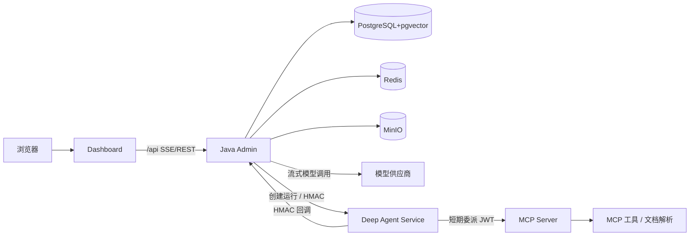

# Aether 架构设计

> 更新日期：2026-08-11
> 面向对象：Java 8 / Spring Boot 2.7.18 / MyBatis-Plus / PostgreSQL + pgvector / Redis / MinIO

---

## 1. 系统组成

Aether 由四个独立项目与三个基础服务组成：

| 项目                          | 技术                                  | 职责                                          |
|-----------------------------|-------------------------------------|---------------------------------------------|
| `aether`（本仓库）               | Java 8、Spring Boot 2.7、MyBatis-Plus | 用户/权限、Agent、知识库、模型配置、会话、运行审计、工作流编排          |
| `aether-dashboard`          | React 18、Umi Max、Ant Design         | 管理控制台与聊天界面（SSE、任务计划、审批、交互卡片）                |
| `aether-deep-agent-service` | Python 3.11、FastAPI、LangChain       | Deep Agent 复杂任务计划与执行、`ask_user`、MCP 工具调用、回调 |
| `aether-mcp-server`         | Python 3.11、MCP、Docling             | MCP Streamable HTTP/stdio 工具服务与文档解析         |

基础服务：PostgreSQL+pgvector、Redis、MinIO。



---

## 2. Java 模块分层

依赖方向（上游 → 下游）：`common → api → biz → admin / front`。

```
admin   可执行 Spring Boot 应用：35 个 REST 控制器、SseEmitter、SSE hub、回调控制器
biz     业务实现：ServiceImpl、Agent 编排、RAG、Deep Agent 集成、工作流运行时
api     契约层：实体、VO、DTO、Mapper、Service 接口、i18n、Flyway 迁移、profile 配置
common  共享基础设施：WebResponse、BaseEntity、Token/AES、全局过滤器、权限 AOP、Redis/MyBatis-Plus 配置
storage MinIO 对象存储抽象（知识库/附件复用；front 不直接依赖）
```

约定：控制器只位于 `admin`；业务实现位于 `biz`；接口/实体/迁移位于 `api`；跨领域基础能力位于 `common`。

---

## 3. 认证与权限

### 3.1 登录令牌

- `POST /api/sys/login` 校验账号密码（BCrypt）后，`TokenUtils.createToken` 生成 JWT（HMAC256，access 6h + refresh 7d），JWT 再经
  `AesUtil` 加密成最终令牌，持久化到 `sys_token`。
- 登录时把用户权限映射写入 Redis Hash `TokenUtils.TOKEN_KEY`（`TokenList`，field=userId）。

### 3.2 请求鉴权链路

1. `GlobalFilter`（`OncePerRequestFilter`，最高优先级）读取 `Authorization: Bearer ...`，AES 解密、JWT 验签与过期校验，向
   `CurrentUser` ThreadLocal 写入 `userId`/`token`（服务账号另写入 `serviceAccountId`）；`tokenVersion` 在每次请求时参与有效性校验，不写入
   ThreadLocal。过滤器在 finally 中清理上下文防止泄漏。
2. `PermissionAspect`（AOP）按方法/类 `@Permission(path, type)` 从 Redis 权限映射读取 `path`，Read 类型要求键存在、Write
   类型要求值为 `true`，否则 403。
3. `GlobalException` 统一把异常转换为 `WebResponse`（400/401/500 等）。

### 3.3 服务账号（client credentials）

- 创建时生成 `sa_` 前缀 32 字节随机密钥，仅 BCrypt 哈希入库；`token_version` 用于吊销。
- `POST /api/auth/service-account/token` 校验 client_id/secret 后签发短期 JWT（默认 900s，最大 3600s），并写入权限映射。
- 每次请求通过 `GlobalFilter` 调用 `ServiceTokenVerifier.isActive(serviceAccountId, tokenVersion)`
  校验启用状态与版本，禁用/轮换/删除即时生效。
- 业务启动额度：Redis 计数 `ServiceAccountWorkflowStarts:{accountId}:{yyyyMMddHH}`（TTL 2h），超限 429。

---

## 4. 普通 Agent 聊天（SSE）

### 4.0 模型解析与能力校验

`ModelCatalogService` 是统一模型解析入口。业务仅保存模型目录 ID，运行时按所需能力读取目录项，确认目录项和所属供应商均启用后生成实际的
`ModelProvider` 调用配置：目录模型名称覆盖 `defaultModel`，存在 `endpointOverride` 时覆盖供应商基础地址。

| 调用链                 | 所需能力                  |
|---------------------|-----------------------|
| Agent 对话、查询重写、AI 审查 | `CHAT` 或 `MULTIMODAL` |
| 知识库与 Skill 路由向量化    | `EMBEDDING`           |
| 知识库重排序              | `RERANK`              |

目录能力正确不等同于供应商端点协议正确。Rerank 仍需使用连接诊断和实际运行验证端点与响应结构。

### 4.1 流程

1. `POST /api/agent/chat/stream` 建立 `SseEmitter`（超时 5 分钟，15s 心跳）。
2. `AgentChatServiceImpl.stream`：
    - 校验 Agent 及其 `CHAT/MULTIMODAL` 模型目录、所属供应商启用，应用深度思考配置（默认关闭）。
    - 创建/复用会话，保存用户消息（可选查询改写，默认关闭）。
    - `ConversationContextService.buildWithSummary` 组装上下文（≤10 条原始消息；超过后注入 `【对话历史摘要】` + 摘要游标之后的消息）。
    - `KnowledgeContextService.enhance` 在 Agent 已授权范围内注入 RAG 检索结果与引用编号；安装 Skill 后还必须应用 Skill
      声明的知识库交集。
    - 调用模型流式接口；工具循环（最多 5 轮）内执行 `ask_user` 或 MCP 审批。
3. 模型分片经 `ModelStreamCallback` → `AgentStreamCallback` → SSE 事件 `message`/`reasoning`/`tool_call`/`question`/
   `done`/`error`。
4. 未安装 Skill 时结束后写 `agent_run`、`agent_tool_call_log`、引用日志，并异步提取管理员偏好。Skill 接入后在首次模型调用前先创建运行记录并冻结
   Skill 快照，结束后再更新其状态和计量。

### 4.2 工具真实性防护

模型若声称调用了工具但无成功的工具调用，`AgentChatServiceImpl` 会去工具重试一次，仍异常则返回道歉消息，防止幻觉伪造工具结果。

---

## 5. 知识库与 RAG

### 5.1 索引管道

1. 文档上传（MinIO）→ `KnowledgeDocumentContentExtractor` 提取文本（Docling 服务解析 PDF/DOCX、XLSX 导入）。
2. `KnowledgeChunkSplitter` 按标题/段落切块（默认 maxChars=2400、overlap=320）。
3. `KnowledgeEmbeddingService` 通过知识库的 `EMBEDDING` 模型目录调用 OpenAI 兼容 `/v1/embeddings`，分批写入
   `knowledge_document_chunk`。
4. 索引任务走 `knowledge_index_job` 队列，`KnowledgeIndexWorker` 定时领取（30 分钟租约）。

### 5.2 混合检索

`KnowledgeRetrievalServiceImpl`：

1. 向量召回：`embedding <=> CAST(... AS vector)`，HNSW 索引。
2. 词法召回（可选）：`to_tsvector('simple', content) @@ plainto_tsquery`，`ts_rank_cd` 排序。
3. 融合打分 `retrievalScore = vectorWeight * normalize(similarity) + (1-vectorWeight) * normalize(lexicalScore)`，可选模型重排。
4. 邻块扩展、去重、token 预算（12000），组装 `【知识库检索结果】` 上下文。
5. 本地缓存：query embedding 缓存（TTL 5min）、检索缓存（TTL 60s）、供应商熔断（3 次失败冷却 30s）。

### 5.3 引用与观测

- 答案正文使用 `【编号】` 引用，`AgentMessage.citations` 记录 `citationIndex/documentName/documentId/chunkId/sectionPath`。
- `knowledge_reference_log`（最终引用）、`knowledge_retrieval_log`（每次候选检索的 cited/outcome）供质量分析。
- `knowledge_retrieval_evaluation_*` 支持离线评测 Recall@K/MRR/NDCG。

### 5.4 审核与 AI 审查

文档版本状态机：`DRAFT → AI_REVIEWING → AI_REVIEWED → SUBMITTED → APPROVED/REJECTED → INDEX_PENDING → INDEXED`。

- AI 审查（`KnowledgeAiReviewWorker` 异步）只生成建议补丁，不直接写正文。
- 审批（`KnowledgeReviewTask`）支持领取、通过、驳回，全程 `knowledge_review_action_log` 留痕。
- 草稿更新、单条/批量采纳和统一应用以 `expectedChecksum` 做乐观并发控制，冲突返回业务码 409；回滚版本不使用该字段。

---

## 6. Deep Agent 集成

### 6.1 运行生命周期

1. `POST /api/agent/chat/stream`（executionMode=DEEP）→ `DeepAgentRunService.startRun`：
    - 保存用户消息 + `agent_run`（状态 QUEUED），生成 `externalRunId`。
    - 用 `mcpDelegationSecret` 签发 5 分钟委派 JWT（claims：runId/userId/agentId/allowedTools）。
    - 通过 `DeepAgentSigningClient.signedPost`（HMAC 头）调 Python `/v1/runs`，期望 202。
2. Python 服务执行中通过回调 `POST /api/agent/deep-runs/callback/{runId}` 回传事件。
3. 事件处理：
    - `message.delta` → 仅流式显示（不写步骤审计表）。
    - `plan.updated`/步骤事件 → 写入 `agent_run_step`（`uk_run_event` 去重），SSE `run_step` 推送。
    - `tool.approval.required` → 生成 MCP 确认卡片（`once`/`allow_10m`/`reject` + 风险分析）。
    - `ask_user.required` → 生成交互式提问卡片（tabs）。
    - `run.completed` → 原子领取状态，保存最终消息、引用来源、token 计量。
4. 用户确认后 `resumeToolApproval` 调 `/v1/runs/{runId}/resume` 恢复。

### 6.2 HMAC 签名

| 方向             | 算法             | 格式                                                                                                                |
|----------------|----------------|-------------------------------------------------------------------------------------------------------------------|
| Java → Deep    | HmacSHA256 hex | `X-Aether-Key-Id`、`X-Aether-Timestamp`、`X-Aether-Signature=hex(HMAC-SHA256(sharedSecret, timestamp+"."+rawBody))` |
| Deep → Java 回调 | 验签             | 时间戳有效期 300s、`MessageDigest.isEqual` 常数时间比较                                                                        |

---

## 7. MCP 工具与风险控制

- `McpClient`/`McpSessionManager` 管理 MCP 连接（http/sse/streamable_http），`McpTransportFactory` 按传输创建。
- `McpToolExecutor` 调用时注入委派 JWT（`Authorization: Bearer <DelegationToken>`）与 `X-Aether-Idempotency-Key`，防止重复执行。
- `ToolCallRiskAnalyzer` 在确认前做确定性风险分级（SQL/Shell 特征正则），fail-closed。普通聊天和手动/业务启动的工作流需用户确认；定时触发的工作流会自动批准其已配置的
  MCP 节点，须通过工作流发布权限、服务账号范围和工具配置控制风险。
- 审批授权缓存：Redis `agent:tool-approval:{userId}:{agentId}:{toolId}` 10 分钟免确认。
- 审计写入 `agent_tool_call_log`（状态：成功/失败/安全拦截/待审批），字段截断防止超长，Authorization 头脱敏。

---

## 8. 会话上下文与摘要

- 上下文缓存：Redis List `agent:context:v2:{conversationId}`（TTL 30min，最多 20 条）。追加采用失效重建，保证与
  `rewrittenContent`/摘要一致。
- 摘要：消息 > 10 条时，`ConversationSummaryService` 后台线程池生成摘要，Redis 锁 `agent:summary:lock:v3:*` 防并发；持久化用
  `summary_covered_*` 游标 CAS。
- token 预算：`ConversationContextService.enforceBudget` 按模型字节比例估算，先裁剪最旧历史，再裁剪系统消息，最后缩写受保护内容并加
  `...[上下文已裁剪]...`。

---

## 9. 工作流运行时

### 9.1 状态机

`AgentWorkflowExecutionServiceImpl`：启动 → 校验（幂等键、人工等待 deadline、并发上限、输入契约）→
遍历图（start/end/human/mcp/agent 节点）→ 人工/MCP 节点暂停 `WAITING_USER` → 恢复/重试/回放/终止/超时。当前 deadline
调度器仅超时处理 `WAITING_USER` 实例，不中断 `RUNNING` 中的节点执行。

- 循环：DFS 回边检测，`_loop_{edgeId}_count` 计数，默认最大 10 次。
- 并发控制：`FOR UPDATE` 行锁 + `max_concurrent_instances`。
- 变量映射：`stateMapping`（`$output` / `$json.path`）或旧式 `outputKey`。

### 9.2 持久化任务队列

`agent_workflow_execution_job` 表驱动：`WorkflowExecutionJobDispatcher` 每秒扫描（1s），条件 UPDATE 领取（5
分钟租约），指数退避重试（10s→5min，默认 8 次）。

### 9.3 触发方式

- 手动 / 业务系统（幂等键 `workflow_id+user_id+idempotency_key` 部分唯一）。
- Webhook（V18）：HmacSHA256 验签 + 时间戳有效期 5min，表达式映射 `$body.*`/`$header.*`。
- 定时（V20）：`next_fire_at` + 5 分钟租约，`WorkflowScheduleTriggerDispatcher` 每 5s 扫描；调度实例幂等键
  `schedule:{triggerId}:{scheduledAt}`，且自动通过 MCP 确认。

### 9.4 回调与运营

- `WorkflowCallbackService`：终态回调（`workflow.completed/failed/terminated/timed_out`），仅暴露 `output_schema`
  声明变量，敏感字段递归脱敏，指数退避重投，`agent_workflow_callback_delivery` 审计。回调签名为
  `X-Aether-Workflow-Signature: sha256={Base64(HMAC-SHA256(secret, timestamp+"."+rawBody))}`，附带事件、投递
  ID、时间戳头；仅网络异常、408、425、429、5xx 自动重试，失败投递可人工重投。
- 运营指标/死信由 `AgentWorkflowMetricsMapper` 直接 SQL 聚合。
- 数据保留：终态实例按 `retention-days`（默认 90 天，`0` 禁用）定时软删除，并同步清理节点审计、回调投递和执行任务。

---

## 10. Redis Key 汇总

| Key                                                     | 类型     | TTL   | 用途        |
|---------------------------------------------------------|--------|-------|-----------|
| `TokenList`（Hash，field=userId）                          | Hash   | -     | 用户权限映射    |
| `agent:tool-approval:{userId}:{agentId}:{toolId}`       | String | 10min | MCP 免确认授权 |
| `agent:context:v2:{conversationId}`                     | List   | 30min | 会话上下文缓存   |
| `agent:summary:v3:{conversationId}`                     | String | 24h   | 摘要快照      |
| `agent:summary:lock:v3:{conversationId}`                | String | 5min  | 摘要生成互斥    |
| `agent:summary:invalidated:v3:{conversationId}`         | String | 24h   | 摘要失效标记    |
| `ServiceAccountWorkflowStarts:{accountId}:{yyyyMMddHH}` | String | 2h    | 服务账号小时额度  |

---

## 11. 安全设计要点

- 密钥/AES：模型 API Key、MCP auth_token、Webhook signing_secret 均 AES 加密入库。
- 服务账号与 Webhook 密钥明文仅在创建/轮换时返回一次，响应带 `Cache-Control: no-store`。
- HMAC 验签全部使用常数时间比较；生产禁止外部回调（白名单 + 签名密钥）。
- MCP 调用注入最小委派 JWT 与幂等键；工具调用前风险分级并需用户确认。
- 不将生产密码、API Key、HMAC 密钥、Git Token 提交到仓库。
