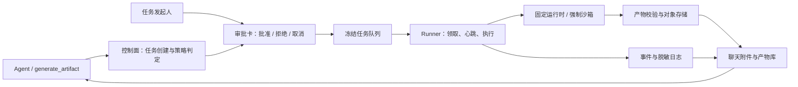

# Sandbox 平台分期开发完整方案

## 总体目标

将现有“通用文件生成 Runner”升级为平台级受控执行能力：Agent 可提出受限脚本，用户按风险审批，任务在隔离环境运行，平台回传可审计的日志和受控产物。

统一原则：模板决定执行边界；Agent 不可控制镜像、Docker 参数、挂载和网络；默认无网络；敏感数据检测、产物治理和审计贯穿全流程。

## 第一期：任务平台基础闭环

目标：将现有 DOCX/XLSX/PDF 产物执行能力规范化为模板任务平台，不扩大执行能力。

- 数据模型：新增执行模板、模板版本、审批记录、执行事件/日志表；保留并兼容 `agent_sandbox_execution`、`agent_artifact`。
- 模板：内置“通用文档生成”模板，固定办公处理运行时、输出类型、60 秒超时、单产物和 50MB 上限。
- 状态机：待审批、排队、已领取、运行中、成功、失败、超时、取消、过期；事件全量记录。
- 聊天页：展示任务审批卡、状态、日志摘要、取消和产物下载；低风险文档生成可自动执行，其余均需发起人确认。
- Admin：模板列表、模板版本、执行审计查询。
- Runner：领取冻结任务、心跳、进度/日志上报、取消查询、完成/失败回传。
- 兼容：`generate_artifact` 映射至通用文档生成模板，不影响既有聊天附件和产物库。
- 验收：并发领取、过期回收、取消、产物校验、审计链、旧接口兼容均通过。

## 第二期：本地分析与文件处理

目标：扩展到无需联网的文件处理和数据分析，保持固定镜像与模板边界。

- 运行时：受控 Python、Node、办公文件处理镜像 allowlist。
- 模板能力：
    - 文件转换、文本/表格提取、CSV/Markdown/Office/PDF 报表处理。
    - Python/Node 数据清洗、汇总、图表、CSV 和 Markdown 报告生成。
- 脚本槽位：模板可声明可选 Python 或 Node 脚本字段；Agent 只提交脚本文本与参数，发起人审批后才进入队列。
- 容器限制：无网络、非特权、只读根文件系统、临时工作区、无宿主挂载、CPU/内存/PID/磁盘/时长配额。
- 文件链路：输入附件通过受控临时路径提供；输出仅能上传平台指定对象存储目录；支持多个受控产物。
- 产物治理：文件名/MIME/大小/哈希/格式有效性校验，病毒或恶意内容扫描接口预留。
- 验收：包含脚本批准、文件输入输出、多产物、资源超限、超时、错误日志脱敏和任务重试场景。

## 第三期：敏感数据与治理策略

目标：在输入、日志、产物全链路实施数据安全控制和组织级治理。

- 敏感扫描：覆盖密钥、令牌、身份证、银行卡、邮箱、手机号等规则；输入、标准输出、错误日志与最终产物独立扫描。
- 风险处置：
    - 低风险本地任务：日志脱敏，风险标记后按模板策略继续或阻断。
    - 命中高风险规则：阻断产物下载或执行，要求重新处理输入。
    - 所有审计记录只保留命中规则、摘要、哈希和时间，不存敏感明文。
- 策略中心：管理员配置模板级资源配额、允许输入/输出格式、脚本能力、风险等级和敏感规则版本。
- 审计中心：按用户、Agent、模板、审批人、风险、状态和时间检索；可查看冻结计划、脚本哈希、日志摘要、产物哈希与资源消耗。
- 留存：执行日志 30 天、产物 7 天、回收站遵循现有保留策略；定时清理并写审计事件。
- 验收：敏感数据不进入原始日志/审计；越权下载、伪造 MIME/哈希、路径穿越和大文件攻击被阻断。

## 第四期：代码验证能力

目标：提供模板化代码检查能力，不开放任意项目或宿主环境执行。

- 预置模板：Python lint/test、Node lint/test/build；模板定义允许命令集合、工作目录规则、最大执行时长和报告格式。
- 输入来源：仅任务附件或平台拉取的受控快照；不挂载宿主项目目录，不读取 Runner/平台凭据。
- 依赖策略：默认使用镜像内预装依赖；需要下载依赖时进入高风险审批，并限制至管理员配置的 registry 白名单。
- 输出：测试报告、覆盖率、构建产物和脱敏执行日志；失败任务可复用冻结输入创建新任务重试。
- 管理能力：按模板设置可用语言、镜像版本、依赖策略、资源限额和审批等级。
- 验收：命令注入、恶意锁文件、依赖源绕过、资源耗尽、测试超时和重复执行均可控。

## 第五期：受控联网与网页采集

目标：在强约束下支持网页采集、截图和结构化提取；默认仍不对普通模板开放。

- 联网仅为显式“网页采集”模板开启，必须由任务发起人审批。
- 网络防护：HTTPS 域名白名单、DNS 重解析与最终 IP 校验、私网/环回/链路本地/Metadata 地址阻断、重定向复核、端口限制。
- 配额：请求数、并发数、页面深度、响应体大小、下载类型、总时长和截图数量均由模板定义。
- 输出：结构化 JSON/CSV、截图、Markdown 摘要；下载文件按第二期产物治理规则处理。
- 审批卡额外显示目标域名、访问目的、允许子域范围、预计请求数和外发敏感风险。
- 验收：SSRF、开放重定向、DNS Rebinding、私网探测、超大下载和跨域跳转全部阻断。

## 第六期：强隔离与企业级运营

目标：降低 Docker Socket Runner 的高权限风险，支持稳定扩展和合规运营。

- 执行底座迁移：从 Docker Socket Runner 逐步迁移到 Kubernetes Job、gVisor 或 Firecracker；保留 Runner API 协议，避免上层接口变化。
- 镜像治理：镜像签名、SBOM、漏洞扫描、版本准入、弃用策略和固定 digest 执行。
- 调度与配额：组织/用户/Agent/模板维度的并发数、每日次数、CPU/内存/存储预算及成本统计。
- 可观测性：队列等待、成功率、超时率、失败类型、敏感命中率、资源用量、镜像风险和审计告警。
- 高可用：多 Runner 抢占、心跳租约、幂等重试、死信队列、断点恢复与灾备清理。
- 验收：Runner 故障、节点故障、重复回调、镜像漏洞、配额耗尽和高并发排队下任务状态及产物一致。

## 共同接口与发布原则

- 对外统一提供：创建任务、审批/拒绝、取消、重试、任务详情、事件/日志查询、产物列表与下载。
- 对内统一提供：领取任务、心跳、进度/日志上报、取消查询、完成/失败/多产物回传。
- 每个任务均冻结模板版本、策略版本、输入摘要、脚本哈希和审批记录，保证可复现与可追溯。
- 每期先发布数据库兼容迁移和 Admin 服务，再发布 Runner，最后发布 Dashboard；新功能通过模板开关逐步启用。
- 每期上线前执行单元、集成、安全和端到端测试；旧 `generate_artifact` 接口、已有产物和下载链路持续兼容。

# Sandbox 平台分期开发完整方案

> 状态：规划基线。本文定义平台受控执行能力的边界、数据契约、分期交付顺序和验收标准；数据库、HTTP 接口与运行时的最终事实来源仍分别是
> Flyway、Controller 和 Runner 实现。

## 1. 目标与不可突破的边界

平台把 Agent 生成的执行意图转换为一个可审批、可冻结、可审计的任务，而不是把 Docker、镜像、命令、挂载或网络控制权交给
Agent。每次执行均由平台确定以下不可变边界：

| 维度    | 平台控制                         | Agent 可提交             |
|-------|------------------------------|-----------------------|
| 执行环境  | 模板固定的运行时、镜像 digest、资源配额和网络策略 | 不可提交                  |
| 可执行内容 | 模板允许的内置入口或显式脚本槽位             | 文档内容；二期起可提交脚本文本和已声明参数 |
| 文件访问  | 平台冻结的输入快照和临时工作区              | 只能引用已授权附件             |
| 输出    | 模板声明的格式、数量、大小和对象存储前缀         | 受限产物内容                |
| 风险决策  | 模板、策略版本和用户审批                 | 可说明目的与预期结果            |

默认拒绝网络、特权容器、宿主挂载、Docker Socket 透传、未声明命令、未冻结输入以及超出模板的输出。Runner
是不可信执行面的受限代理；它只能依据冻结任务调用控制面 API，不能读取业务数据库或平台密钥。

## 2. 总体架构

控制面位于 `admin` + `biz`：负责身份、审批、状态转换、冻结和审计。`sandbox-runner` 只轮询内部接口并在隔离运行时执行。Dashboard
通过用户态 API 查看任务、审批、取消、日志摘要和已授权产物；不得调用 Runner 内部接口。

## 3. 统一任务模型与状态机

### 3.1 任务状态

状态使用稳定字符串枚举，避免以历史 `agent_sandbox_execution.status` 的数值含义作为新协议：

| 状态                 | 含义                 | 合法迁移                                         |
|--------------------|--------------------|----------------------------------------------|
| `PENDING_APPROVAL` | 已冻结，等待发起人决定        | `QUEUED`、`CANCELLED`、`EXPIRED`               |
| `QUEUED`           | 可被 Runner 领取       | `CLAIMED`、`CANCELLED`、`EXPIRED`              |
| `CLAIMED`          | 已发放短期执行令牌，尚未确认运行   | `RUNNING`、`QUEUED`、`CANCELLED`、`EXPIRED`     |
| `RUNNING`          | Runner 持续心跳并上报进度   | `SUCCEEDED`、`FAILED`、`TIMED_OUT`、`CANCELLED` |
| `SUCCEEDED`        | 所有最终产物已校验、登记       | 终态                                           |
| `FAILED`           | 运行或校验失败            | 终态；可由重试创建新任务                                 |
| `TIMED_OUT`        | 达到模板时限或领取/心跳租约失效   | 终态；可由重试创建新任务                                 |
| `CANCELLED`        | 发起人取消；Runner 需停止执行 | 终态                                           |
| `EXPIRED`          | 审批或队列等待超过模板时限      | 终态                                           |

每次状态变化必须在同一事务内追加事件。取消是一个持久意图：运行中的任务先标记 `cancel_requested_at`，Runner
在下一次取消查询或心跳响应中收到停止指令；最终状态只由控制面幂等落库。

### 3.2 冻结原则

创建任务时保存：模板 ID 与版本、策略版本、模板配置快照、输入附件摘要、输入 JSON 哈希、脚本哈希（没有脚本则为空）、请求人/Agent/运行
ID、风险判定、审批要求和过期时间。后续编辑模板、策略、附件或 Agent 均不会修改已创建任务。

## 4. 数据模型与兼容策略

第一期新增四类表，保留 `agent_sandbox_execution`、`agent_artifact` 作为旧链路和产物库的兼容投影。

| 表                                    | 关键字段                                                                                            | 职责                                     |
|--------------------------------------|-------------------------------------------------------------------------------------------------|----------------------------------------|
| `sandbox_execution_template`         | `code`、`name`、`enabled`、`risk_level`、`current_version_id`                                       | 管理员可见的模板逻辑对象；`code` 全局唯一               |
| `sandbox_execution_template_version` | `template_id`、`version`、`config_snapshot`、`policy_version`、`published_at`                       | 不可变模板版本；配置包含运行时、格式、时限、数量与大小限制          |
| `sandbox_execution_task`             | `template_version_id`、`status`、`input_snapshot`、`script_sha256`、`lease_*`、`cancel_requested_at` | 新状态机的权威任务记录                            |
| `sandbox_execution_approval`         | `task_id`、`decision`、`approver_user_id`、`reason`、`decided_at`                                   | 审批记录；每个决定只追加，不覆盖                       |
| `sandbox_execution_event`            | `task_id`、`sequence`、`event_type`、`status`、`summary`、`occurred_at`                              | 全量审计事件与脱敏日志摘要；`(task_id, sequence)` 唯一 |

建议在一期迁移中为任务表增加 `(status, expires_at, created_at)`、`(lease_expires_at)`、
`(requester_user_id, created_at DESC)` 索引，为事件表增加 `(task_id, sequence)` 和 `(occurred_at)` 索引。使用
`SELECT … FOR UPDATE SKIP LOCKED`（或带状态与版本号的 compare-and-set）领取，避免多 Runner 重复执行。

### 4.1 `generate_artifact` 兼容映射

`SkillArtifactExecutionService.request` 保持现有 MCP 接口和请求字段不变。其内部改为创建 `generic-document` 模板的冻结任务：格式仅
`docx`、`xlsx`、`pdf`，固定办公运行时，60 秒，最多一个产物且不超过 50 MiB。低风险且会话审批策略允许自动执行时直接进入 `QUEUED`
；否则为 `PENDING_APPROVAL`。成功产物仍创建 `agent_artifact`，并沿用现有聊天附件和文件库下载接口。

在迁移窗口，旧 `agent_sandbox_execution` 可由 `sandbox_execution_task.legacy_execution_id`
关联，或由兼容服务同步写入。不得批量重写既有历史记录；审计查询应同时显示旧执行记录的有限字段。

## 5. 对外与对内接口契约

所有用户态接口从 `/api/agent/sandbox/tasks` 提供，受现有登录、资源权限及任务所有权校验保护：

| 方法     | 路径                                       | 用途                               |
|--------|------------------------------------------|----------------------------------|
| `POST` | `/`                                      | 创建冻结任务；仅接受模板代码、已授权输入、声明参数和可选脚本槽位 |
| `POST` | `/{id}/approve`、`/{id}/reject`           | 发起人审批或拒绝，使用请求幂等键                 |
| `POST` | `/{id}/cancel`                           | 请求取消；终态重复调用成功返回当前状态              |
| `POST` | `/{id}/retry`                            | 从失败/超时/取消任务复制冻结输入创建新任务           |
| `GET`  | `/{id}`、`/{id}/events`、`/{id}/artifacts` | 详情、事件/日志摘要和产物清单                  |

Runner 内部接口从 `/api/internal/sandbox/runner` 提供，只接受独立 Runner 服务凭据和任务短期令牌：

| 方法     | 路径                             | 语义                                  |
|--------|--------------------------------|-------------------------------------|
| `POST` | `/claim`                       | 原子领取一项任务，返回冻结快照和一次性执行令牌             |
| `POST` | `/tasks/{id}/heartbeat`        | 续租并上报阶段与受限进度；响应返回 `cancelRequested` |
| `GET`  | `/tasks/{id}/cancel`           | 允许长任务主动轮询取消意图                       |
| `POST` | `/tasks/{id}/events`           | 上报结构化、脱敏后的日志事件；携带单调 `sequence` 保证幂等 |
| `POST` | `/tasks/{id}/complete`、`/fail` | 回传经校验的一个或多个产物，或失败分类与脱敏摘要            |

完成、失败、心跳和事件均必须验证：Runner 凭据、执行令牌签名、任务 ID 一致、令牌哈希、租约未失效及允许的状态迁移。重复回调以
`(task_id, event sequence)` 和产物 SHA-256 幂等处理，不能生成重复产物或覆盖终态。

## 6. 第一期：任务平台基础闭环

### 范围

1. 新增模板、版本、审批、任务、事件的 Flyway 兼容迁移，并初始化已发布的 `generic-document` v1 模板。
2. 实现模板查询、任务创建/审批/取消/详情/事件/审计 API；Admin 提供模板列表、版本查看和执行审计查询。
3. 使 Runner 支持原子领取、心跳、日志摘要、取消查询、超时与完成/失败回传。运行时继续使用现有固定办公镜像，不增加 Python/Node
   自定义脚本能力。
4. 聊天页显示审批卡、状态与日志摘要；任务成功后继续通过现有 `agent_artifact` 下载和附件渲染展示产物。
5. 将 `generate_artifact` 映射至模板任务，不改变 MCP 工具名称、请求体、已有附件或产物库 URL。

### 一期审批规则

`generic-document` 默认风险等级为 `LOW`。当会话策略是 `never` 或 `risky` 时可自动排队；`ask`
策略创建待审批任务。非低风险模板一律待审批。创建时写入审批策略快照，后续会话设置改变不影响任务。

### 一期验收

- 两个 Runner 并发 claim 同一队列时，一项任务只被领取一次。
- 租约失效的 `CLAIMED` / `RUNNING` 任务被回收或标记超时，且写入事件。
- 取消在队列、已领取和运行中均可靠生效，重复调用无副作用。
- 仅允许 `docx`、`xlsx`、`pdf`，单文件不超过 50 MiB；文件名、MIME、扩展名与 SHA-256 均一致才入库。
- 任意状态变化、审批、领取、心跳、日志摘要和产物登记都可按任务顺序追溯。
- 现有 `generate_artifact`、消息附件、`/api/agent/artifact/*` 和历史产物均不回归。

## 7. 第二期：本地分析与文件处理

新增固定 digest 的 Python、Node 和办公文件处理镜像 allowlist。模板可声明语言为 `python` 或 `node` 的脚本槽位、输入参数
Schema、输入/输出格式和多产物限额；Agent 提交的是脚本文本与参数，脚本原文只存于受控冻结输入，审计只保存 SHA-256 与脱敏摘要。

容器必须保持无网络、非特权、只读根、最小 Linux capabilities、`no-new-privileges`、受限 PID/CPU/内存/临时磁盘、非 root
用户和最长时限。输入附件使用每任务临时只读目录，输出只允许平台指定目录；Runner 不得将宿主路径、Docker Socket、环境凭据或任意
volume 暴露给任务。

产物允许多个，但每个均执行路径规范化、文件名限制、MIME/扩展名/大小/SHA-256/格式有效性校验。预留异步恶意内容扫描
SPI，在扫描结果未通过前不发放下载链接。

## 8. 第三期：敏感数据与治理策略

输入、标准输出、标准错误与每个最终产物独立扫描。规则覆盖密钥、令牌、身份证、银行卡、邮箱和手机号，并产生 `ruleId`
、风险等级、内容哈希和时间；审计库不保存命中文本或可逆片段。

低风险本地任务默认对日志替换敏感值并保留风险标记；高风险命中依模板策略在入队前阻断，或在完成后阻断下载。策略中心按模板版本配置资源额度、脚本能力、允许格式、风险等级、扫描规则版本和命中动作。日志保留
30 天，产物保留 7 天，回收站沿用现有策略；清理任务也必须追加审计事件。

## 9. 第四期：代码验证能力

仅提供预置 Python lint/test、Node lint/test/build
模板。模板声明一个不可由请求覆盖的命令集合、工作目录规则、时限、报告格式、固定镜像及依赖策略。输入限于附件或平台生成的受控快照，严禁挂载任意宿主项目。

默认只使用镜像内依赖。需要下载依赖时标记高风险审批，并以 egress 代理限制到管理员 registry 白名单、固定
TLS、包大小和总下载额度。锁文件、命令参数和报告路径均按不可信输入处理；失败重试从冻结输入克隆，不复用旧执行令牌或旧输出目录。

## 10. 第五期：受控联网与网页采集

联网能力只属于显式网页采集模板，且总是需要发起人审批。执行代理必须执行 HTTPS 域名 allowlist、端口白名单、每跳重定向复核、DNS
解析后与连接时的最终 IP 校验，并拒绝环回、私网、链路本地、保留地址及云 Metadata 范围。禁止直接由容器自行解析并连接任意 URL。

模板冻结目标域名、允许子域范围、访问目的、请求/并发/深度/响应体/下载/截图/总时长额度。审批卡显示这些字段和潜在敏感外发风险。JSON、CSV、截图和
Markdown 摘要仍进入二期产物治理链路。

## 11. 第六期：强隔离与企业运营

保持 Runner API 协议不变，将执行底座由 Docker Socket Runner 分批迁移到 Kubernetes Job + gVisor，或 Firecracker。镜像必须按
digest 执行，并接入签名、SBOM、漏洞扫描、准入与弃用策略。

调度增加组织、用户、Agent、模板维度的并发与日配额、CPU/内存/存储预算及成本账本。可观测性覆盖队列时延、成功/失败/超时率、失败分类、敏感命中、资源消耗、镜像风险和审计告警。采用租约、幂等回调、死信队列、可重放事件和灾备清理处理
Runner/节点故障与高并发。

## 12. 发布与安全测试

每期按“兼容迁移与 Admin 控制面 → Runner → Dashboard”的顺序发布，功能仅通过已发布模板和开关逐步开放。迁移必须可在旧 Runner
仍在线时执行；新 Runner 必须向后兼容一期的 `generic-document` 任务。

上线门禁至少包括单元、PostgreSQL 集成、Runner 协议、端到端聊天附件、并发领取、重放回调、租约过期、取消、产物格式与哈希校验测试。二期以后还必须覆盖路径穿越、大文件、伪造
MIME/哈希、日志泄漏、命令注入、恶意锁文件、资源耗尽、SSRF、DNS rebinding、私网探测和开放重定向。安全测试失败时，模板保持禁用而不是降级放行。

## 13. 实施顺序与完成定义

1. 先落地一期数据迁移和状态机服务，以 `generic-document` 验证新旧双链路。
2. 再升级 Runner 协议与容器清理/租约处理，完成控制面闭环。
3. 最后接入 Dashboard 审批卡和 Admin 查询界面，并以开关灰度。
4. 每一期仅在该期验收测试、旧接口回归和安全测试全部通过后，发布下一类模板能力。

完成不等于 Runner 能执行脚本；完成意味着任何一次执行都能回答“谁以哪个模板版本、审批了什么、对哪些冻结输入做了什么、消耗了什么资源、产生了哪些经过校验的产物”，并且该答案不泄露敏感明文。

### 当前实现增量

- 二期输入以产物库 ID 提交，服务端复制到任务专属对象前缀，Runner 在有效租约内下载并做 SHA-256
  校验后只读挂载；外部对象键、宿主路径和调用方挂载参数均不进入协议。
- 重试任务会重新校验并复制冻结附件到新的任务专属前缀，原任务的输入留存清理不会影响重试任务；新任务快照仅引用自身对象键。
- 三期提供默认的本地规则扫描：密钥、身份证和银行卡阻断；邮箱/手机号只记录规则标识，不记录命中明文。
- 敏感输入、Runner 日志和产物命中会额外写入 `subjectSha256`；审计事件只保留规则标识、脱敏摘要、哈希和时间，绝不保存命中明文。
- Admin 审计列表可进入任务详情，查看审批链、资源摘要和完整执行事件；敏感命中仅展示规则与 `subjectSha256`，不展示原始内容。
- 四期预置的 Python/Node 检查模板采用 `FIXED_COMMAND`；模板默认禁用，依赖策略为 `PREINSTALLED_ONLY`。ZIP
  快照在入队前校验路径、条目数和解压后总大小，镜像完成预装工具验收后才可由管理员启用。
- 五期网页采集模板同样默认禁用。控制面仅接受 HTTPS、443 端口和模板 allowlist 中的域名；当前 Docker Runner 对该模式
  fail-closed，必须先部署可执行连接时 DNS 重解析、最终 IP 与重定向复核的 egress 代理，才可启用。
- 网页采集任务还必须冻结访问目的、预计请求数和页面深度；审批卡展示目标、允许域/子域、请求与深度配额及外发敏感风险，超出模板上限的计划在入队前拒绝。
- 六期 Runner 回调采用稳定实例 ID 绑定租约；产物回传以任务、文件名和 SHA-256 去重，相同回调可安全重放而不会创建额外对象或消耗多产物额度。
- Runner 在成功、失败、超时、取消和启动前策略拒绝的所有退出路径中，均尽力回传 wall time、输出字节和退出码；租约已终止时允许该补充回调失败，不会阻塞本地资源清理。
- 对成功任务，Runner 必须在最终产物回传前持久化资源用量，因为最终产物会将任务转换为终态；失败、超时和取消仍由 `finally`
  的最佳努力回传覆盖。
- Runner 主动超时统一以 `TIMED_OUT` 回传；服务端将其落为状态机的 `TIMED_OUT`，而不是泛化为 `FAILED`，与租约超时回收保持相同语义。
- 运行中收到取消请求时，Runner 显式回传 `CANCELLED`；平台将任务终结为 `CANCELLED`，不会将正常取消错误归因为租约超时。
- 服务端在产物回传入口再次检查取消标记；取消请求一经持久化，后续产物不写入对象存储、不创建产物记录，也不可下载。
- 若 Runner 在取消过程中失联，租约恢复优先读取已持久化的取消标记并终结为 `CANCELLED`；只有未请求取消的过期租约才进入
  `TIMED_OUT`。
- 管理员可发布新的不可变模板策略版本；发布时校验运行时 allowlist、网络模式、脚本槽位、固定命令、输出格式和可选镜像
  digest。已创建任务继续使用原冻结版本，只有新任务使用新的当前版本；发布任何非 `NONE` 网络策略会立即停用模板，直至受控
  egress 底座实际可用。
- 策略发布同时硬性校验执行超时、产物数/大小、输入数/大小及可选的内存、CPU、PID、临时磁盘边界，防止依赖 Runner 的隐式夹紧来纠正不安全配置。

## 14. 当前交付边界

| 能力                            | 当前状态                     | 生产启用条件                                                               |
|-------------------------------|--------------------------|----------------------------------------------------------------------|
| 一期文档任务、审批、状态机、旧接口桥接           | 已实现                      | 数据库迁移、Admin、Runner 与 Dashboard 同步发布                                  |
| 二期脚本、冻结附件、多产物、资源限额            | 已实现，分析模板默认停用             | 固定运行时镜像完成验收后由管理员启用                                                   |
| 三期基础敏感规则、日志/产物脱敏、留存           | 已实现基础规则                  | 接入组织规则版本与外部恶意文件扫描服务                                                  |
| 四期固定命令代码检查                    | 已实现，模板默认停用               | 预装依赖镜像、ZIP 快照验收与管理员启用                                                |
| 五期网页采集                        | 控制面校验与 fail-closed 模板已实现 | 部署受控 egress 代理（连接时 DNS/IP 与重定向复核）后才可启用                               |
| 六期多 Runner、幂等、配额、指标、digest 通道 | 已实现控制面基础                 | Kubernetes/gVisor 或 Firecracker 执行底座、镜像签名/SBOM/漏洞扫描、组织成本账本仍需运维基础设施配合 |

当前 Docker Socket Runner 只允许网络为 `NONE` 的模板执行。任何尚未满足外部基础设施前提的模板必须保持禁用；这是一项安全约束，而非可选降级策略。
