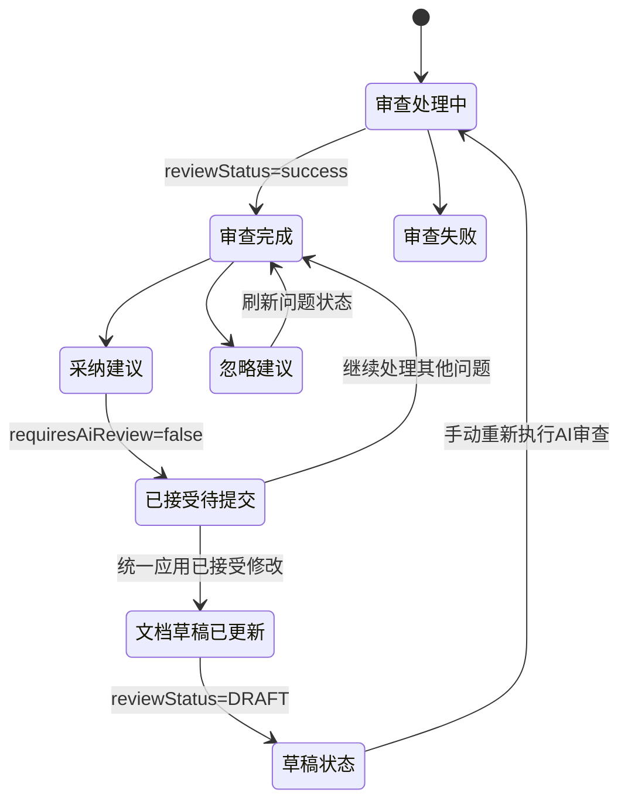

# 知识库 AI 审查 Diff 工作台前端对接方案

## 1. 目标与范围

本文面向知识库文档工作台的前端实现，覆盖 AI 审查结果的差异预览、逐条采纳、逐条忽略、批量采纳、并发冲突处理和重新审查引导。

本次对接基于后端已提供的 AI 审查 Diff 接口。前端**不得自行根据 `suggestedPatch` 拼装全文**，而应始终展示接口返回的 `proposedContent`，以保证预览规则与实际提交规则一致。

当前知识库成员权限功能处于移除状态；前端无需请求成员角色接口，也不要根据成员角色隐藏 AI 审查操作。仍保留现有菜单/资源权限和后端写权限校验。

### 上线前置条件

后端部署前须执行 PostgreSQL 脚本：

`api/src/main/resources/sql/postgresql/006-knowledge-ai-review-diff.sql`

该脚本增加 AI 审查原文快照及已采纳内容记录字段。未执行时，Diff 审查的历史回放和采纳链路不完整。

## 2. 页面入口与模块划分

沿用已有前端路由，不新增一级菜单：

| 路由 | 页面 | 入口方式 | 职责 |
| --- | --- | --- | --- |
| `/knowledge/document/detail` | 文档工作台 | 文档列表“进入工作台” | 编辑文档、发起 AI 审查、查看当前审查状态 |
| `/knowledge/review/detail` | 审批详情 / AI 审查 Diff 工作台 | 工作台“查看审查结果”、审批中心 | 比较原文与建议稿，处理问题项 |
| `/knowledge/reviews` | 审批中心 | 知识库管理菜单 | 查看待人工审批的文档版本；通过后可跳转 Diff |

建议目录结构（以现有 `./knowledge/review/detail` 为边界）：

```text
src/pages/knowledge/review/detail/
  index.tsx                    # 路由页：加载 reviewId，控制页面状态
  components/
    ReviewDiffToolbar.tsx      # 状态、统计、批量操作、重新审查入口
    ReviewDiffEditor.tsx       # Monaco DiffEditor 封装
    ReviewIssueList.tsx        # 问题清单、筛选和定位
    ReviewIssueCard.tsx        # 单问题详情及操作
    ReplacementEditor.tsx      # 可选的人类修改建议输入框
  hooks/
    useAiReviewDiff.ts         # 查询、失效、mutation 与冲突处理
  types.ts
  constants.ts
src/services/knowledge/aiReview.ts
```

## 3. 页面设计与交互

### 3.1 总体布局

采用 GitHub PR 的审阅节奏：顶部概览，中部左右差异，右侧问题清单。

```text
┌─────────────────────────────────────────────────────────────────────────┐
│ 返回工作台  文档名 / 版本号  [AI 审查完成]  待处理 3  高风险 1           │
│ [批量采纳 2 项]  [应用 2 项已接受修改]                                 │
├─────────────────────────────┬───────────────────────────────────────────┤
│ 原始内容                     │ 建议内容                                  │
│ Monaco DiffEditor            │ Monaco DiffEditor                          │
│ originalContent              │ proposedContent                             │
├─────────────────────────────┴───────────────────────┬───────────────────┤
│ 差异区/行号高亮                                     │ 问题清单          │
│                                                      │ 严重度、摘要      │
│                                                      │ [采纳] [忽略]     │
└──────────────────────────────────────────────────────┴───────────────────┘
```

推荐使用 `@monaco-editor/react` 的 `DiffEditor`：左侧只读原始内容，右侧只读建议稿。不要让用户直接在 DiffEditor 的右侧全文编辑；针对单条问题使用独立的“修改建议文本”弹层/抽屉，以便将用户输入明确作为 `replacement` 传给采纳接口。

### 3.2 状态与按钮规则

| 情况 | 页面表现 | 允许操作 |
| --- | --- | --- |
| `reviewStatus=AI_REVIEWED` 且 `stale=false` | 展示完整 Diff | 采纳到待提交修改、忽略；非严重问题可批量采纳 |
| `stale=true` | 顶部黄色提示：“文档已变更，当前建议已失效” | 禁用采纳和批量采纳；提供重新审查 |
| 审查非 `success` | 显示处理中/失败状态，不展示可采纳 Diff | 仅重试或返回工作台 |
| `handleStatus=accepted` | 绿色“已接受，待提交”，建议已进入右侧预览但尚未写入草稿 | 不可再次操作 |
| `handleStatus=rejected` | 灰色“已忽略” | 不可再次操作 |
| 无 `suggestedPatch` | 显示“仅发现问题，暂无可自动应用的建议” | 只允许忽略或回到文档手工编辑 |
| `severity=critical` | 红色风险标记 | 不进入批量采纳；必须逐条确认 |
| `acceptedCount > 0`、`reviewStatus=AI_REVIEWED` 且 `stale=false` | 工具栏启用“应用 N 项已接受修改” | 一次性写入草稿 |

单条或批量“采纳”仅更新问题处理状态，不会修改文档正文。成功后应重新请求 Diff，使 `proposedContent`、已接受数量和问题状态保持一致。只有“应用已接受修改”成功后才会写入草稿，版本转为 `DRAFT`；前端应禁用当前审查的处理动作，并提示“修改已保存为草稿，可继续编辑或手动重新发起 AI 审查”。

### 3.3 问题定位与筛选

问题清单默认按：`critical`、`high`、`medium`、`low`，再按原文起始行升序排列。提供“全部 / 待处理 / 已采纳 / 已忽略 / 高风险”筛选。

点击问题项时：

1. 使用 `baseStartLine` / `baseEndLine` 定位左侧原文。
2. 若 `proposedStartLine > 0`，同步定位右侧建议稿；值为 `0` 时只高亮原文，因为替换/删除后右侧可能没有对应行。
3. 在卡片中展示 `message`、`originalExcerpt` 和建议摘要。

`blockId` 仅作为稳定的展示/定位标识，不应被当作可修改内容的依据。

## 4. 接口对接

所有接口遵循项目统一响应包裹：

```ts
interface WebResponse<T> {
  code: number;
  message: string;
  data: T;
  total?: number;
}
```

### 4.1 获取 Diff 工作台数据

`GET /api/knowledge/ai-review/{reviewId}/diff`

```ts
type AiReviewDiff = {
  reviewId: string;
  documentId: string;
  documentVersionId: string;
  contentChecksum: string;
  reviewStatus: string;
  stale: boolean;
  originalContent: string;
  proposedContent: string;
  issues: AiReviewDiffIssue[];
  pendingCount: number;
  acceptedCount: number;
  rejectedCount: number;
  criticalPendingCount: number;
};

type AiReviewDiffIssue = {
  id: string;
  blockId?: string;
  issueType: string;
  severity: 'critical' | 'high' | 'medium' | 'low' | string;
  message: string;
  originalExcerpt?: string;
  suggestedPatch?: SuggestedPatch;
  handleStatus: 'pending' | 'accepted' | 'rejected' | string;
  baseStartLine?: number;
  baseEndLine?: number;
  proposedStartLine?: number;
  proposedEndLine?: number;
};

type SuggestedPatch = {
  operation: 'replace' | 'insert_before' | 'insert_after' | 'delete' | 'set_heading';
  target: { original: string };
  replacement?: string;
  level?: number;
  title?: string;
};
```

页面首次打开、单条采纳/忽略后、批量采纳后、统一应用成功后、收到 409 冲突后都必须重新请求该接口。

### 4.2 采纳单个建议

`POST /api/knowledge/ai-review/{reviewId}/issues/{issueId}/accept`

```ts
type AcceptIssuePayload = {
  expectedChecksum: string; // 必填，取当前 diff.contentChecksum
  replacement?: string;     // 可选，人工改写后覆盖 AI replacement
  comment?: string;
};

type AcceptIssueResult = {
  documentVersionId: string;
  contentChecksum: string;
  reviewStatus: string;
  issueStatus: string;
  requiresAiReview: boolean;
};
```

只有 `handleStatus=pending`、存在 `suggestedPatch`、`reviewStatus=AI_REVIEWED` 且 `stale=false` 时展示为可点击。提交时锁定当前问题卡片，成功后关闭编辑弹层并刷新 Diff。`requiresAiReview=false` 表示本次只完成暂存，不需要重新审查。

### 4.3 忽略单个建议

`POST /api/knowledge/ai-review/{reviewId}/issues/{issueId}/reject`

```ts
type RejectIssuePayload = { comment?: string };
```

忽略不会改写文档正文。成功后刷新 Diff 即可；建议保留“忽略原因”输入，但允许为空。

### 4.4 批量采纳

`POST /api/knowledge/ai-review/{reviewId}/issues/accept-batch`

```ts
type BatchAcceptPayload = {
  issueIds: string[];
  expectedChecksum: string; // 必填，取当前 diff.contentChecksum
  comment?: string;
};
```

批量操作的候选项限定为：`pending`、存在 `suggestedPatch`、非 `critical`。后端只暂存接受状态；前端不能拆分成多个单条请求。成功后刷新 Diff，由右侧建议稿展示全部暂存结果。

### 4.5 统一应用已接受修改

`POST /api/knowledge/ai-review/{reviewId}/issues/apply`

```ts
type ApplyAcceptedIssuesPayload = {
  expectedChecksum: string; // 必填，取当前 diff.contentChecksum
};
```

该接口是唯一会修改草稿正文的操作。仅当 `acceptedCount > 0`、`reviewStatus=AI_REVIEWED` 且 `stale=false` 时启用工具栏按钮。点击后必须弹出确认框，明确说明：

1. 将一次性写入全部已接受建议。
2. 写入后文档版本转为 `DRAFT`。
3. 系统不会自动发起新的 AI 审查。

成功时，响应中的 `contentChecksum` 和 `reviewStatus` 是新的草稿状态。前端应更新本地 checksum，重新加载版本和 Diff，并禁用当前审查继续处理的操作。若返回 `409`，重新加载 Diff，不得静默重试。

### 4.6 关联查询

| 接口 | 使用位置 |
| --- | --- |
| `GET /api/knowledge/ai-review/{id}` | 顶部审查状态、失败原因、执行时间 |
| `GET /api/knowledge/ai-review/version/{versionId}/latest` | 从文档工作台找到最新审查并决定跳转/发起审查 |
| `GET /api/knowledge/ai-review/{id}/issues` | 非 Diff 的简版问题列表或兼容现有审批详情；Diff 页面优先使用 `/diff` 中的 `issues` |

## 5. 请求封装示例

```ts
// src/services/knowledge/aiReview.ts
import { request } from '@umijs/max';

export const getAiReviewDiff = (reviewId: string) =>
  request<WebResponse<AiReviewDiff>>(`/api/knowledge/ai-review/${reviewId}/diff`);

export const acceptAiReviewIssue = (
  reviewId: string,
  issueId: string,
  data: AcceptIssuePayload,
) => request<WebResponse<AcceptIssueResult>>(
  `/api/knowledge/ai-review/${reviewId}/issues/${issueId}/accept`,
  { method: 'POST', data },
);

export const rejectAiReviewIssue = (reviewId: string, issueId: string, comment?: string) =>
  request<WebResponse<void>>(
    `/api/knowledge/ai-review/${reviewId}/issues/${issueId}/reject`,
    { method: 'POST', data: { comment } },
  );

export const acceptAiReviewIssues = (reviewId: string, data: BatchAcceptPayload) =>
  request<WebResponse<AcceptIssueResult>>(
    `/api/knowledge/ai-review/${reviewId}/issues/accept-batch`,
    { method: 'POST', data },
  );

export const applyAcceptedAiReviewIssues = (
  reviewId: string,
  data: ApplyAcceptedIssuesPayload,
) => request<WebResponse<AcceptIssueResult>>(
  `/api/knowledge/ai-review/${reviewId}/issues/apply`,
  { method: 'POST', data },
);
```

若当前项目请求封装已经自动解包 `WebResponse.data`，上述泛型按实际封装调整；不要因此改变 URL、方法或请求体字段。

## 6. 并发、失败与缓存策略

### 6.1 乐观锁冲突

每次采纳、批量采纳和统一应用都必须发送当前 `contentChecksum`。后端返回 HTTP 409 时，说明文档已由其他操作更新、补丁冲突或当前审查已失效：

1. 停止当前提交态，不自动重试。
2. 清理本地选中项和临时 `replacement`。
3. 重新获取版本、最新审查和 `/diff` 数据。
4. 提示用户“文档内容已变化，已刷新到最新审查结果”。

### 6.2 错误提示映射

| 场景 | 建议提示 |
| --- | --- |
| 400 | 请求参数不完整，请刷新后重试 |
| 404 | 审查记录或文档版本不存在 |
| 409 | 文档或审查状态已变化，已刷新最新数据 |
| 500 / 网络错误 | 操作未完成，请稍后重试；保留当前筛选条件 |

不要将后端错误信息直接作为唯一用户文案，但可在“详情”中显示以便排障。

### 6.3 React Query / Umi 缓存键

建议查询键：

```ts
['knowledge', 'ai-review', reviewId, 'diff']
['knowledge', 'ai-review', reviewId, 'detail']
['knowledge', 'document-version', documentVersionId]
['knowledge', 'ai-review', 'latest', documentVersionId]
```

采纳或忽略成功后，失效 `diff` 和 `detail`；统一应用成功后，失效以上四类键。页面卸载时取消尚未完成的加载请求，避免路由切换后覆盖新页面数据。

## 7. 状态流转



业务上，采纳建议只会暂存问题状态，用户可以继续处理当前审查中的其他建议。只有统一应用会变更版本正文并结束当前审查会话；前端必须以刷新后的审查状态为准，而不是保留旧页面数据继续提交。

## 8. 实施顺序与验收

建议按以下顺序交付：

1. 完成 API 类型、查询与 mutation 封装。
2. 在文档工作台增加“查看 AI 审查结果”入口，使用 `reviewId` 跳转 `/knowledge/review/detail`。
3. 完成 DiffEditor、问题列表、行定位和筛选。
4. 接入单条采纳、忽略和批量采纳，加入确认弹层与 loading 状态。
5. 接入“应用已接受修改”，应用成功后返回草稿编辑状态。
6. 完成 409 刷新、失效遮罩、手动重新审查引导及端到端验收。

验收用例：

- 审查成功时，左右两栏准确显示 `originalContent` 与 `proposedContent`。
- 点击问题可定位原文；删除类建议不会因右侧行号为 0 而报错。
- 单条采纳后页面刷新，且提示重新 AI 审查，不再允许使用旧建议继续采纳。
- 批量采纳不会提交 `critical` 问题或无补丁问题。
- 文档被并发更新时，页面能处理 409、清理临时操作并刷新。
- 已采纳和已忽略问题都有可追溯的只读状态，刷新后不丢失。
