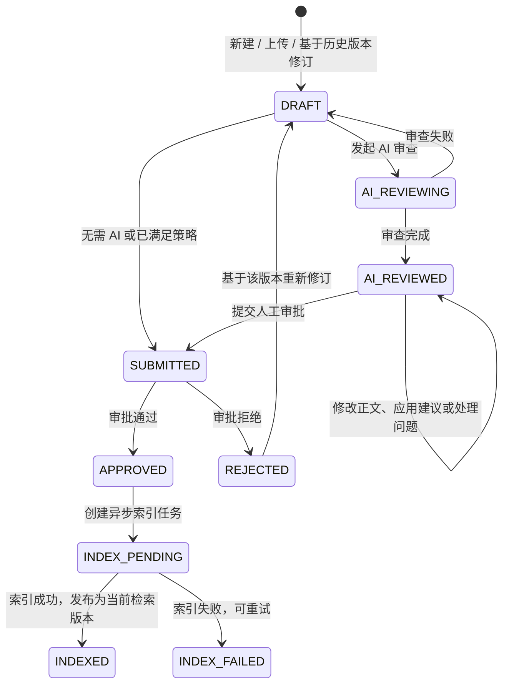

# 知识库文档审查前端对接方案

## 1. 目标与边界

前端以“草稿不可直接入库、审核通过后才发布和索引”为主线，实现文档创建、AI 审查、人工修改、人工审批、索引跟踪五个环节。

后端统一返回：

```ts
type ApiResponse<T> = { code: number; message: string; data: T; total: number }
```

- `code === 200`：成功；分页数据在 `data`，总数在 `total`。
- `400/409`：表单或状态冲突，直接展示 `message` 并刷新当前详情。
- `403`：没有知识库读写/审批权限；`404`：资源不存在。
- 所有时间字段均为 Unix 毫秒时间戳，前端统一格式化。

## 2. 状态与页面动作



| 文档/版本状态 | 前端显示 | 可用动作 |
| --- | --- | --- |
| `DRAFT` | 草稿 | 编辑、发起 AI 审查、提交审批（取决于知识库策略） |
| `AI_REVIEWING` | AI 审查中 | 只读、轮询 AI 审查结果 |
| `AI_REVIEWED` | AI 预检完成 | 编辑、处理问题、提交审批；AI 必审时全部问题处理完后才能提交 |
| `SUBMITTED` | 人工审批中 | 查看审批进度；审批人可认领、通过、拒绝 |
| `APPROVED` | 已通过，索引中/已发布 | 查看索引任务、失败重试、基于该版本修订 |
| `REJECTED` | 已拒绝 | 查看理由、基于该版本修订 |

重要约束：编辑草稿时必须传回版本详情中的 `contentChecksum` 作为 `expectedChecksum`。收到 `409` 表示草稿已被其他操作更新，禁止覆盖，前端应重新拉取版本详情。

## 3. 页面与模块划分

### 3.1 知识库列表与配置页

路由建议：`/knowledge/bases`、`/knowledge/bases/:id/settings`

- 列表：名称、范围、可见性、Owner、嵌入 Provider、状态、文档数量（若后续补充）、操作。
- 新建/编辑抽屉：基础信息、检索配置、审查策略三组。
- 审查策略是必填 JSON 配置，建议在前端用表单编辑后再序列化，禁止让用户直接填写 JSON。
- 设置页增加“成员管理”标签：仅拥有 `manage_members` 能力的成员可查看、添加、修改、移除成员。负责人由 `ownerAdminId` 表示，不作为普通成员角色维护。

```ts
type ReviewConfig = {
  autoAiReview: boolean
  aiReviewRequired: boolean
  blockOnCriticalIssues: boolean
  requireDifferentApprover: boolean
  reviewModelProviderId: string // 必填，启用的非 embedding Provider
  reviewModel?: string          // 空时由后端填 Provider 默认模型
}
```

成员角色策略单独存储在 `memberRoleConfig`，由知识库负责人维护。角色名称和角色编码均可配置；后端只识别能力集合：`read`、`write`、`approve`、`manage_members`。

```ts
type MemberRoleConfig = {
  roles: Array<{
    code: string // 小写字母、数字、_、-；不能为 owner
    name: string
    permissions: Array<'read' | 'write' | 'approve' | 'manage_members'>
  }>
}
```

建议默认值全部为 `true`，并将“AI 审查模型”做成必选下拉框。`ownerAdminId` 只读展示，不在普通编辑表单中提交。

### 3.2 文档列表页

路由建议：`/knowledge/documents`

- 服务端筛选：知识库、标题、文档处理状态（`status`）、审查状态。索引状态仅展示，当前接口不支持按 `indexStatus` 分页筛选。
- 列：标题、知识库、当前发布版本、审查状态、索引状态、更新时间、操作。
- 主操作：新建文本、上传文件、查看详情；仅在无活动草稿/审批任务时显示删除。
- 建议状态徽标同时展示 `reviewStatus` 和 `indexStatus`，不要把“审批通过”误显示为“已可检索”。

### 3.3 文档编辑与审查工作台

路由建议：`/knowledge/documents/:id`，草稿链接为 `/knowledge/documents/:id?version=:versionId`。

布局建议：左侧版本时间线，中部 Markdown/富文本编辑器，右侧为“AI 审查 / 审批记录 / 索引分块”标签页。

- 顶部：标题、版本号、审查状态、索引状态、保存、AI 审查、提交审批按钮。
- 版本时间线：显示版本号、来源版本、提交/审批人和时间；点击加载对应版本，只读历史版本。
- 编辑器：加载 `version.content`；保存时调用草稿更新接口；保存成功后以响应中的新 `contentChecksum` 替换本地并发令牌。
- AI 审查面板：分数、摘要、模型、问题清单；建议高亮 `originalExcerpt`，展示 `suggestedPatch` 但不自动改写正文。
- 提交审批前：AI 必审时必须存在成功预检且不存在任何 `pending` 问题；提示作者接受、手动修复、拒绝或忽略每项问题，最终以后端 `409` 校验为准。

### 3.4 审批中心

路由建议：`/knowledge/reviews`、`/knowledge/reviews/:taskId`

- 顶部 Tab：`可审批`、`我提交的`、`我已审批`、`全部`，分别映射 `view=available/submittedByMe/reviewedByMe/all`。
- 列：文档标题、版本、提交人、任务状态、提交时间、认领人、操作。
- 详情：左侧版本内容，中部 AI 审查及问题，右侧审批意见与动作日志。
- `pending` 任务先显示“认领”；`claimed` 且当前人为认领人时显示“通过/拒绝”。拒绝应要求填写原因。
- 通过接口返回索引任务 ID；立即跳转/刷新索引任务面板，而不是等待同步完成。

### 3.5 索引任务抽屉或页面

路由建议：`/knowledge/index-jobs`

- 列：任务类型、文档/版本、状态、重试次数、错误信息、开始/结束时间。
- `pending/running` 每 3 秒轮询；`failed` 显示重试；`success` 停止轮询。
- 文档详情在审批通过后也应轮询该任务，成功后刷新文档详情以更新已发布版本和索引状态。

## 4. 接口清单

请求头：`Authorization: Bearer <token>`；文件上传使用 `multipart/form-data`，其他写操作使用 `application/json`。

### 4.1 知识库

| 用途 | 方法与地址 | 请求重点 | 返回 |
| --- | --- | --- | --- |
| 列表 | `POST /api/knowledge/base/list` | `{ current, pageSize, name?, scope?, embeddingProviderId? }` | `KnowledgeBaseVo[]` + `total` |
| 详情 | `GET /api/knowledge/base/{id}` | - | `KnowledgeBaseVo` |
| 创建 | `POST /api/knowledge/base` | `name, scope?, visibility?, embeddingProviderId, reviewConfig` | 知识库 ID |
| 更新 | `PUT /api/knowledge/base/{id}` | 可编辑基础字段及 `reviewConfig` | 空 |
| 删除 | `DELETE /api/knowledge/base/{id}` | - | 空 |
| 成员列表 | `GET /api/knowledge/base/{id}/member/list` | - | `KnowledgeBaseMember[]` |
| 添加成员 | `POST /api/knowledge/base/{id}/member` | `{ adminId, role }` | 成员 ID |
| 修改成员角色 | `PUT /api/knowledge/base/{id}/member/{adminId}` | `{ role }` | 空 |
| 移除成员 | `DELETE /api/knowledge/base/{id}/member/{adminId}` | - | 空 |

成员管理规则：只能分配当前 `memberRoleConfig` 中已定义的角色；拥有 `manage_members` 的成员可以维护成员关系。成员管理本身还要求系统 `/knowledge/base` 写权限；仅负责人可以修改角色策略配置。

### 4.2 文档、版本与草稿

| 用途 | 方法与地址 | 请求重点 | 返回 |
| --- | --- | --- | --- |
| 文档列表 | `POST /api/knowledge/document/list` | `{ current, pageSize, knowledgeBaseId?, title?, status?, reviewStatus? }` | `KnowledgeDocumentVo[]` + `total` |
| 文档详情 | `GET /api/knowledge/document/{id}` | - | `KnowledgeDocumentVo` |
| 新建文本 | `POST /api/knowledge/document` | `knowledgeBaseId, title, content, sourceUrl?, sourceType?, parserType?` | 文档 ID |
| 上传 | `POST /api/knowledge/document/upload` | FormData: `knowledgeBaseId, file, title?` | 草稿版本 ID |
| 文档版本列表 | `GET /api/knowledge/document/{id}/versions` | - | `KnowledgeDocumentVersion[]` |
| 版本详情 | `GET /api/knowledge/document/version/{versionId}` | - | `KnowledgeDocumentVersion` |
| 更新草稿 | `PUT /api/knowledge/document/version/{versionId}/draft` | `{ content, expectedChecksum }` | 更新后的版本 |
| 基于历史版本修订 | `POST /api/knowledge/document/version/{versionId}/revise` | - | 新草稿版本 ID |
| 原文件预览 | `GET /api/knowledge/document/{id}/preview-url` | - | 10 分钟有效的预签名 URL |
| 分块查看 | `GET /api/knowledge/document/version/{versionId}/chunk/list` | - | `KnowledgeDocumentChunkVo[]` |
| 删除 | `DELETE /api/knowledge/document/{id}` | - | 空；有活动草稿/审批任务会返回 `409` |

新建和上传均可能自动启动 AI 审查。前端创建后应先拉取文档版本，再根据状态决定是否开始轮询。

### 4.3 AI 审查与问题处理

| 用途 | 方法与地址 | 请求重点 | 返回 |
| --- | --- | --- | --- |
| 手动发起 | `POST /api/knowledge/document/version/{versionId}/ai-review` | - | AI 审查 ID |
| 最新审查 | `GET /api/knowledge/ai-review/version/{versionId}/latest` | - | `KnowledgeAiReview \| null` |
| 审查详情 | `GET /api/knowledge/ai-review/{id}` | - | `KnowledgeAiReview` |
| 问题列表 | `GET /api/knowledge/ai-review/{id}/issues` | - | `KnowledgeAiReviewIssue[]` |
| 处理问题 | `PUT /api/knowledge/ai-review/issue/{issueId}/handle` | `{ status, comment? }` | 空 |

`KnowledgeAiReview.status`：`pending`、`running`、`success`、`failed`、`stale`。轮询 `pending/running`；`failed/stale` 显示 `errorMessage` 并允许回到草稿后重新发起。

问题处理状态：`accepted`（已采纳）、`rejected`（不采纳）、`manually_fixed`（已手动修复）、`ignored`（忽略）。AI 审查是预检：完成预检后编辑正文或应用建议仍保持 `AI_REVIEWED`，但手动修改不会自动关闭问题，作者必须逐条标记相关问题的处理结果。

### 4.4 提交、审批与索引

| 用途 | 方法与地址 | 请求重点 | 返回 |
| --- | --- | --- | --- |
| 提交审批 | `POST /api/knowledge/document/version/{versionId}/submit` | `{ comment? }` | 审批任务 ID |
| 审批任务列表 | `POST /api/knowledge/review-task/list` | `{ current, pageSize, view?, status?, knowledgeBaseId?, documentId? }` | `KnowledgeReviewTaskVo[]` + `total` |
| 审批任务详情 | `GET /api/knowledge/review-task/{id}` | - | 任务、文档、版本、AI 审查、问题、动作日志 |
| 认领 | `POST /api/knowledge/review-task/{id}/claim` | - | 空 |
| 通过 | `POST /api/knowledge/review-task/{id}/approve` | `{ comment? }` | 索引任务 ID |
| 拒绝 | `POST /api/knowledge/review-task/{id}/reject` | `{ comment }` | 空 |
| 索引任务列表 | `POST /api/knowledge/index-job/list` | `{ current, pageSize, knowledgeBaseId?, documentId?, jobType?, status? }` | `KnowledgeIndexJob[]` + `total` |
| 索引任务详情 | `GET /api/knowledge/index-job/{id}` | - | `KnowledgeIndexJob` |
| 重试索引 | `POST /api/knowledge/index-job/{id}/retry` | - | 新任务 ID |
| 重建已发布索引 | `POST /api/knowledge/document/{id}/reindex` | - | 成功消息中含任务 ID |

## 5. 前端数据模型与轮询建议

```ts
type DraftSession = {
  documentId: string
  versionId: string
  reviewStatus: 'DRAFT' | 'AI_REVIEWING' | 'AI_REVIEWED' | 'SUBMITTED' | 'APPROVED' | 'REJECTED'
  content: string
  expectedChecksum: string // = version.contentChecksum
}
```

1. 进入编辑器：并行获取文档详情、版本列表、当前版本详情、最新 AI 审查。
2. `AI_REVIEWING`：每 3 秒调用“最新审查”；状态结束后刷新版本详情和问题列表。
3. `SUBMITTED`：每 5 秒调用审批任务详情，直到任务状态为 `approved/rejected`。
4. 审批通过：每 3 秒调用索引任务详情，直到 `success/failed`；然后刷新文档详情和版本列表。
5. 离开页面、切换版本或浏览器失焦超过 1 分钟时停止轮询；重新聚焦后立即刷新一次。

## 6. 前端验收清单

- 创建文本/上传文件后，页面进入草稿或 AI 审查中状态，文档不会直接显示为已发布。
- 编辑草稿携带 `expectedChecksum`；模拟双窗口编辑时，后一窗口能收到 `409` 并被提示刷新。
- AI 问题可以逐条处理，正文仍由人工编辑器修改，不自动应用模型建议。
- 需要 AI 审查的知识库，未经 `AI_REVIEWED` 状态提交会显示后端拒绝原因。
- 审批人不能越权审批；启用“提交人与审批人不同”时，提交人不能审批自己的任务。
- 审批通过后索引任务异步显示；只有任务成功后文档才显示为已发布/可检索。
- `failed` 索引任务可重试；所有轮询均能在终态停止。
