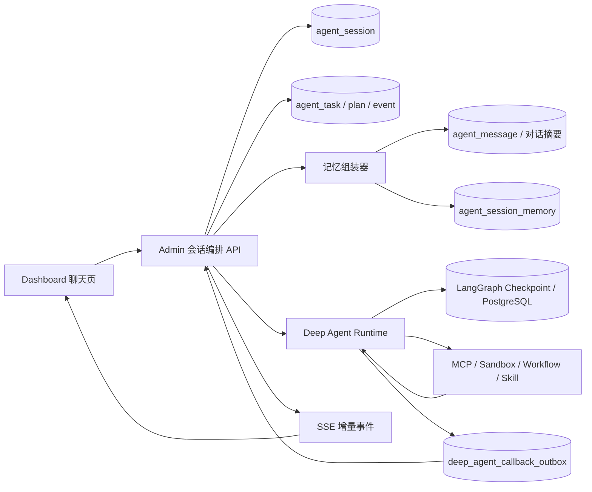

# 持续智能体会话记忆与动态执行重构方案

## 1. 背景与结论

当前 Deep Agent 已具备 PostgreSQL 检查点、工具审批、`ask_user` 中断和单次运行恢复能力，但其运行模型仍是“每条请求创建一个
`run_id`，完成后结束”。`run_id` 同时承担图线程标识和执行记录标识，导致后续消息不会加载之前任务的运行状态、结论或上下文。

本方案将 Deep Agent 重构为持续智能体：

- `conversation_id` 对应一个长期存在的 **Agent Session**；
- 每条用户消息形成 Session 内的一个 **Task**，而非独立智能体实例；
- `run_id` 降级为 Task 的一次执行尝试和计量记录；
- Agent 基于分层记忆、当前任务状态与工具观察结果持续决策；
- 计划可以在执行中变化，暂停、询问、审批和重启后均从同一 Session 继续；
- 不存储或展示原始思维链，只保存可验证的计划、动作、结果和决策摘要。

首期兼容现有 `executionMode=DEEP`，不改变标准聊天 Agent 的请求协议。

## 2. 目标、边界与非目标

### 2.1 目标

1. 同一会话的后续 Deep 请求能够理解已完成任务、用户回答、产物和未完成事项。
2. 任务计划由运行时观察驱动，可新增、取消、替换或重试步骤，并保留版本历史。
3. 服务重启、浏览器断连、审批或 `ask_user` 中断后，用户可在原会话恢复任务。
4. 将 MCP、Sandbox、Skill、工作流统一成“可调度行动”，受同一审批、幂等和审计模型约束。
5. Dashboard 展示当前任务、近期任务、计划演进和结果摘要，不展示模型原始推理。

### 2.2 边界

- PostgreSQL 是 Session、Task、计划、记忆与审计投影的权威存储。
- Redis 仅用于在线状态、SSE 扇出、短期缓存和锁，不作为可恢复状态来源。
- 历史消息、长期偏好和工具结果均按用户与会话权限隔离。
- Skill 指令、工具范围和委派令牌仍以每次 Task 创建时的冻结快照为准。

### 2.3 非目标

- 不把模型的逐 token 思维过程、隐式推理或完整敏感工具输出写入数据库。
- 首期不实现跨用户共享记忆，也不自动把任意对话写入用户偏好。
- 首期不实现失败任务的一键自动重试；失败后由用户明确发起继续或创建新任务。

## 3. 现状问题

| 现状                           | 后果             | 重构原则                        |
|------------------------------|----------------|-----------------------------|
| LangGraph `thread_id=run_id` | 每次聊天都是新图线程     | 改为 `thread_id=session_id`   |
| Deep 请求仅带当前 `task`、提示词和检索片段  | 无法理解前序会话       | 独立传递受预算控制的 Session Memory   |
| `agent_run` 同时表达任务和尝试        | 无法描述持续任务及其多次恢复 | 分离 Session、Task、Run Attempt |
| 初始计划近似一次性列表                  | 不能表达观察后的路径变化   | 计划版本化、步骤状态机化                |
| 执行记录按 Run 查询                 | 用户看不到会话内上下文关系  | 增加 Session 时间线和关联任务视图       |

## 4. 目标架构



责任划分：

- **Admin**：身份与权限、会话归属、Task 生命周期、记忆投影、计划投影、审批、消息持久化和 SSE。
- **Deep Agent**：Session 内的决策循环、图检查点、工具调用编排、行动结果观察和回调投递。
- **MCP/Sandbox/Workflow**：提供受授权、可审计、具备幂等键的行动能力。
- **Dashboard**：读取历史快照并订阅增量，不将前端内存作为任务或记忆真相来源。

## 5. 领域模型与状态机

### 5.1 Agent Session

`agent_session` 一对一绑定 Deep 会话，建议以 `conversation_id` 作为稳定外部标识。

| 字段                                | 含义                                                             |
|-----------------------------------|----------------------------------------------------------------|
| `id`                              | 内部主键                                                           |
| `conversation_id`                 | 关联聊天会话，唯一                                                      |
| `agent_definition_id`、`user_id`   | 归属隔离                                                           |
| `status`                          | `ACTIVE`、`WAITING_USER`、`WAITING_APPROVAL`、`PAUSED`、`ARCHIVED` |
| `graph_thread_id`                 | 固定为 Session ID，用于 LangGraph checkpoint                         |
| `active_task_id`                  | 当前活动任务，可为空                                                     |
| `memory_version`、`last_active_at` | 记忆刷新与并发控制                                                      |

### 5.2 Task 与 Run Attempt

`agent_task` 表示用户意图形成的长期工作单元；`agent_run` 保留并关联 `task_id`，表示某次实际执行尝试。

Task 状态：

```text
QUEUED → PLANNING → RUNNING → COMPLETED
                    ├→ WAITING_USER → RUNNING
                    ├→ WAITING_APPROVAL → RUNNING
                    ├→ PAUSED → RUNNING
                    ├→ FAILED
                    └→ CANCELLED
```

新消息到达时，Session 调度器先判断：它是当前 Task 的补充、继续指令、目标变更，还是新 Task。判断结果与原因作为 `agent_event`
保存；低置信度时调用 `ask_user`，不得自行覆盖用户目标。

### 5.3 动态计划

保留并演进现有 `agent_run_plan`、`agent_run_plan_version`、`agent_run_plan_step`：

- 计划归属从 `run_id` 扩展为 `task_id`；保留最后 `run_id` 便于兼容旧接口。
- 每个版本记录 `reason`：`INITIAL`、`TOOL_RESULT`、`USER_INPUT`、`GOAL_CHANGED`、`STEP_FAILED`、`RESUME`。
- 已完成步骤不可改写；不再适用的未执行步骤标记 `SUPERSEDED`。
- 步骤保存目标、依赖、允许行动、稳定幂等键、尝试次数、脱敏结果摘要和关闭标准。

## 6. 分层记忆设计

### 6.1 记忆层级

| 层级   | 存储                | 写入时机         | 注入模型的规则                 |
|------|-------------------|--------------|-------------------------|
| 工作记忆 | Task 状态、当前计划、未决中断 | 每个动作后        | 每次调用必带                  |
| 会话记忆 | 对话摘要 + 最近消息       | 消息完成后滚动更新    | 同一 Session，按 token 预算裁剪 |
| 任务记忆 | 结论、产物、失败原因、待办     | Task 结束或阶段完成 | 当前/关联任务优先               |
| 用户偏好 | 经确认的长期偏好          | 用户显式确认或设置页   | 仅同一用户、低优先级参考            |
| 检索记忆 | 历史任务和产物的向量索引      | 异步索引         | 仅返回授权范围内 Top-K 摘要       |

### 6.2 记忆记录

新增 `agent_session_memory`：

- `session_id`、`memory_type`、`content`、`summary`、`source_task_id`；
- `importance`、`confidence`、`expires_at`、`version`；
- `sensitivity_level` 与脱敏标记；
- `source_event_id` 用于追溯写入来源。

新增 `agent_user_preference_memory`，只保存用户确认的稳定偏好；临时回答、口令、令牌、隐私字段默认禁止写入。

### 6.3 上下文组装

每次模型调用按以下顺序组装，后项不能覆盖前项权限边界：

1. 固定系统安全策略与当前 Skill 冻结指令；
2. 当前 Task 目标、状态、计划和未决审批/提问；
3. Session 摘要；
4. 最近的用户/助手消息及关键工具结果摘要；
5. 相关历史 Task 的结论和产物引用；
6. 当前 RAG 检索结果；
7. 当前用户消息。

沿用 `ConversationContextService` 的摘要、预算和消息脱敏能力，但增加 `buildDeepSessionMemory(...)`
专用方法。该方法必须在保存当前用户消息前读取历史，避免把当前输入重复注入。

## 7. Deep Agent Runtime 重构

### 7.1 稳定图线程

- `DeepRunRequest` 新增 `session_id`、`task_id`、`conversation_memory`、`task_state`。
- `LangGraph configurable.thread_id` 从 `run_id` 修改为 `session_id`。
- `run_id` 作为 checkpoint 的命名空间/执行尝试标签；同一 Session 的历史状态不会因新消息丢失。
- 重启时将运行中 Task 标为 `PAUSED`；恢复时读取 Session 的最后安全 checkpoint。

### 7.2 决策循环

```text
加载 Session 与 Task 状态
  → 组装分层记忆
  → 判断：继续当前任务 / 创建新任务 / 等待用户
  → 规划或重规划当前最小可执行步骤
  → 执行一个行动
  → 验证结果、保存事件与检查点
  → 更新记忆、推进步骤或重规划
  → 完成、暂停、等待审批或等待用户
```

每次循环只允许一个可验证的有副作用行动。行动开始前生成 `idempotency_key=session_id:task_id:step_key:attempt`
；恢复时只重放未确认完成的行动。对状态未知的外部行动进入 `WAITING_APPROVAL`，不得盲目重试。

### 7.3 `ask_user` 与审批

- `ask_user` 专用于信息收集，强制 choice + 自定义输入，使用 `respond` 将真实回答写回被中断工具调用。
- MCP/Sandbox 审批专用 approve/reject，不与 `ask_user` 共用交互语义。
- 用户回答先保存为 Session 事件和消息，再恢复图；恢复上下文包含回答及其关联问题，避免重复提问。

## 8. 数据库迁移

Admin Flyway 新增迁移，表名以 `agent_` 为前缀：

1. `agent_session`、`agent_task`、`agent_task_event`；
2. `agent_session_memory`、`agent_user_preference_memory`；
3. 为 `agent_run` 增加 `session_id`、`task_id`、`attempt_no`；
4. 为计划表增加 `task_id`、计划版本原因、步骤幂等与结果字段；
5. 为 `(user_id, conversation_id)`、`(session_id, status)`、`(task_id, sequence)`、待恢复 Task 建立索引。

Deep Agent PostgreSQL 继续仅保存运行时图数据：`deep_agent_run`、LangGraph checkpoint、待交互数据与 callback outbox。业务
Session/Task 的权威视图仍在 Admin PostgreSQL 表中，避免两套业务真相。

迁移策略：先新增字段和双写，不修改已应用的 Flyway；旧 `agent_run` 自动回填一个“历史 Session/Task”关联。稳定后再将新查询切换为
Session 模型。

## 9. 接口与事件

### 9.1 Admin API

| 接口                                                               | 用途                                             |
|------------------------------------------------------------------|------------------------------------------------|
| `POST /api/agent/session/conversation/{conversationId}/messages` | 向持续 Agent 投递消息，返回 `sessionId`、`taskId`、`runId` |
| `GET /api/agent/session/conversation/{conversationId}`           | Session 状态、当前任务和记忆摘要元数据                        |
| `GET /api/agent/session/conversation/{conversationId}/timeline`  | 任务、计划、审批、产物和事件时间线                              |
| `GET /api/agent/session/task/{taskId}`                           | Task、当前计划和历史版本                                 |
| `POST /api/agent/session/task/{taskId}/pause`                    | 暂停当前任务并保存检查点                                   |
| `POST /api/agent/session/task/{taskId}/resume`                   | 归属用户继续任务                                       |
| `POST /api/agent/session/task/{taskId}/input`                    | 回答 `ask_user` 或补充信息                            |
| `GET /api/agent/session/{sessionId}/memory`                      | 查询用户可见的会话记忆摘要                                  |
| `DELETE /api/agent/session/{sessionId}/memory/{memoryId}`        | 删除经确认的会话记忆或长期偏好                                |
| `POST /api/agent/session/{sessionId}/memory/feedback`            | 用户确认或修正长期偏好                                    |
| `GET /api/agent/session/{sessionId}/metrics`                     | 单个 Session 的任务完成率、人工介入和记忆数量                    |
| `GET /api/agent/session/overview`                                | 当前用户范围内的 Session、Task 和记忆运营指标                  |

原 `/api/agent/run/{id}`、计划、暂停和继续接口保留为兼容层，内部解析到关联 Task。

### 9.2 Deep Agent API

- `POST /v1/sessions/{sessionId}/tasks`：创建或继续 Task；
- `POST /v1/sessions/{sessionId}/tasks/{taskId}/resume`：注入审批/用户回答并恢复；
- `GET /v1/sessions/{sessionId}`：运行时状态和最新 checkpoint；
- 过渡期保留 `/v1/runs`，由 Admin 将它映射为 Session Task。

### 9.3 SSE 事件

统一事件包括：`session.updated`、`task.created`、`task.status_changed`、`plan.updated`、`step.started`、`step.completed`、
`memory.updated`、`ask_user.required`、`tool.approval.required`、`artifact.created`、`task.completed`、`task.failed`。

所有事件带 `event_id`、`session_id`、`task_id`、`run_id`、时间戳和脱敏数据，Admin 按 `event_id` 幂等投影。

## 10. Dashboard 设计

- 聊天页右侧任务规划区改为 Session 工作区：顶部显示当前 Task，列表展示同会话近期 Task；
- 当前任务自动展开，计划版本变更标注原因，完成任务可折叠；
- 显示“记住了什么”的摘要和来源，不显示隐式思考；用户可删除已确认偏好；
- 刷新后先拉取 Session 快照与时间线，再连接 SSE 接收增量；
- 执行记录页按 Run 展示成本与原始请求快照，并提供“关联任务/会话”跳转。

## 11. 安全、治理与可观测性

1. Session、Task 和 Memory 查询必须校验用户归属和 Agent 权限。
2. 记忆写入采用敏感信息检测、长度限制、允许类型白名单和用户确认策略。
3. 委派令牌仅存在单次 Run 请求，绝不进入 Memory、Event、计划或前端。
4. 记录决策摘要、工具参数摘要和结果摘要；密码、令牌、完整私钥和未脱敏文件内容禁止入库。
5. 指标：Session 活跃数、恢复成功率、重复提问率、重规划次数、工具幂等命中率、记忆命中率、上下文 token、任务完成率与人工介入率。

## 12. 分阶段实施计划

### Phase 0：边界固化

- 明确 `run_id`、`task_id`、`session_id` 的职责；补齐现有运行事件的关联字段。
- 将 `ask_user` 和工具审批的 Schema、恢复协议彻底分离。

### Phase 1：会话记忆可用

- 新增 `agent_session`、`agent_task` 和 Session Memory 表。
- Admin 使用现有对话摘要 + 最近消息生成 `conversation_memory`；Deep 请求与输入快照包含记忆版本。
- Deep Agent 接收并按预算注入记忆；`thread_id` 切换为 `session_id`。
- Dashboard 在刷新后可恢复当前任务和最近任务。

### Phase 2：动态任务运行时

- 引入 Task 状态机、计划版本原因、步骤幂等键和统一事件表。
- 将执行器改为“观察—决策—行动—检查点”循环；工具结果、失败和用户补充触发重规划。
- 兼容旧 run API，并双写验证投影一致性。

### Phase 3：长期记忆与能力编排

- 用户确认偏好、任务结论/产物索引和跨 Task 检索。
- MCP、Sandbox、工作流、Skill 统一行动描述与风险策略。
- 加入并发 Task 冲突检测和 Session 级队列。

### Phase 4：运营与治理

- 记忆管理 UI、数据保留/删除、质量反馈、指标大盘与异常告警。
- 基于真实会话构建回归集，评估记忆命中、重复提问和错误继承。

## 13. 测试与验收

### 13.1 单元与契约测试

- Admin：同一 `conversation_id` 创建/复用 Session；跨用户不可读取；历史消息与摘要按预算裁剪。
- Deep Agent：`session_id` 线程恢复、用户回答注入、计划重规划、幂等行动跳过。
- API：旧 run 接口与新 task/session 接口映射一致；重复 callback 不重复写事件。
- Dashboard：刷新后恢复当前任务、历史时间线、暂停/继续、记忆反馈。

### 13.2 集成验收场景

1. 用户在同一会话先要求分析合同，再说“按刚才的高风险条款生成整改清单”；Agent 能引用前序结论，不重新要求上传合同。
2. Task 完成一个工具行动后暂停、重启 Deep Agent、继续；已完成动作不重复执行。
3. `ask_user` 回答具体对象后，原 Task 继续且不重复同题。
4. 工具结果导致原计划不再适用时，生成新计划版本，已完成步骤仍可审计。
5. 用户删除一条偏好后，后续请求不再注入该偏好；其他用户和其他会话不可访问。

验收指标：跨轮上下文命中率 100%（测试集）、重复提问率低于 2%、恢复后重复副作用调用为 0、所有事件和产物可从 Session 时间线追溯。

## 14. 决策与后续动作

建议优先实施 Phase 1：它直接解决跨轮记忆缺失，并为后续动态 Task Runtime 提供稳定身份。Phase 1 完成后再切换规划与执行循环，避免在旧的
`run_id` 模型上继续叠加复杂状态。
